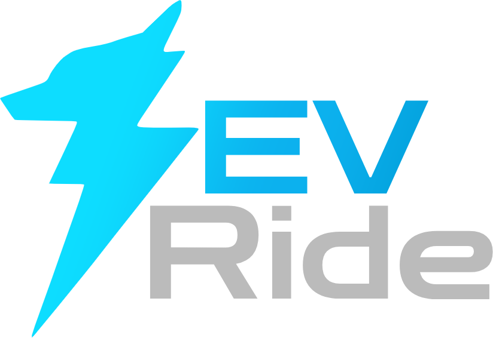

  

### Descrição

O EVRide é um marketplace de veículos elétricos que possibilita a negociação dentro da própria plataforma através de um chat integrado entre comprador e vendedor.

### Projeto em funcionamento

## Tecnologias utilizadas

### Front-end:
- Typescript
- NextJS
- Tailwind CSS

### Back-end:
- Typescript
- Express
- Prisma ORM
- JWT token
